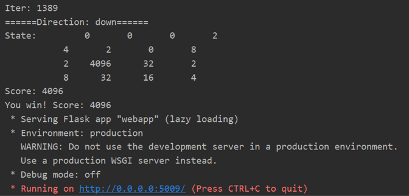

# 2048_Planning
2048 Agent using Monte Carlo method, can reach 4096. 
It has a cnn layer to extract checkerboard feature and a lstm layer to make logic decision, and
utilize a strong model to train itself.

## Code structure
* [`game2048/`](game2048/): the main package.
    * [`montecarlo.py`](game2048/montecarlo.py): the main model for this planning method
    * [`game.py`](game2048/game.py): the core 2048 `Game` class.
    * [`agents.py`](game2048/agents.py): the `Agent` class with instances.
    * [`displays.py`](game2048/displays.py): the `Display` class with instances, to show the `Game` state.
    * [`expectimax/`](game2048/expectimax): a powerful ExpectiMax agent by [here](https://github.com/nneonneo/2048-ai).
* [`explore.ipynb`](explore.ipynb): introduce how to use the `Agent`, `Display` and `Game`.
* [`static/`](static/): frontend assets (based on Vue.js) for web app.
* [`webapp.py`](webapp.py): run the web app (backend) demo.
* [`evaluate.py`](evaluate.py): evaluate your self-defined agent.

## Requirements
* code only tested on linux system (ubuntu 16.04)
* Python 3 (Anaconda 3.6.3 specifically) with numpy and flask

## Run the web app
```bash
python3 webapp.py
```
Then it automatically run the planing agent. After a few minutes, you will get the result.

## Result

